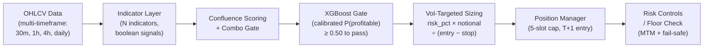

# Buffett Quant System

> Autonomous equity trading system: technical indicator confluence → XGBoost meta-labeling gate → vol-targeted execution.

---

## Architecture



> The validated configuration uses **τ = 0.50**. The live bot currently runs a stricter threshold of **τ = 0.75**.

---

## "The Backtest I Didn't Believe"

The first full backtest returned a Sharpe ratio above 4. That number was not
celebrated — it was treated as a bug report.

A real edge in a liquid equity market with realistic costs doesn't produce
Sharpe >4. Either the system has a genuine, enormous advantage (unlikely on
first attempt), or something is wrong with the measurement. Spoiler: seven
things were wrong with the measurement.

**What the rebuild caught:**

- **Label leakage:** Forward labels overlapped the validation window — the model
  saw the future during training. Purged + embargoed CV brought AUC from
  0.843 → 0.659. The lower number is real.
- **Uncalibrated gate:** Raw XGBoost probabilities are ordered but not scaled to
  true probabilities. "τ = 0.75" meant nothing without calibration. Added
  isotonic regression calibration; the threshold now means what it says.
- **Survivorship bias:** The initial universe was hand-picked from names that had
  "worked." Partially addressed by adding non-surviving names to the universe;
  remains a known limitation (universe chosen with some hindsight).
- **Drawdown diluted ~4×:** The evaluator computed drawdown on a hidden $100k
  base for a ~$20k account, understating drawdown approximately 4×. Fixed to
  portfolio-basis mark-to-market on real equity.
- **Tail concentration:** Worst-5% of trades came from 5 micro-caps; 3 had no
  statistical edge (entire CI negative) and were pruned; 2 with real edge were
  kept.
- **Disabled safety floor:** The portfolio floor was disabled in code; re-enabled;
  then rebuilt from entry-price to mark-to-market, with a data-outage fail-safe
  that halts when equity is within a buffer of the floor and alerts otherwise.
- **Partial-exit logging bug:** A quantity-weighting error fabricated losses on
  partial exits. Corrected with an auditable correction file — the original log
  is preserved. History was not rewritten.

The final out-of-sample expectancy is ~1.3R/trade, with a 95% CI lower bound
above zero. This is plausible for a confluence-based discretionary-style signal
with realistic costs applied. The initial Sharpe of >4 was not.

Full postmortems for each bug: [docs/validation.md](docs/validation.md)

---

## Validation Methodology

### Walk-Forward Cross-Validation

Random splits on financial time series leak the future. This system uses
purged/embargoed walk-forward CV throughout:

- **Forward labels:** 20 bars (+15% TP before −5% stop within 20 bars)
- **Embargo:** ≥ 20 bars (≥ label horizon), removed from the end of each
  training set to prevent label overlap with the validation window.
- **Walk-forward:** 36 folds, 2023-07 → 2026-06

Result: no bar's label ever reflects price data from the validation period.

### Isotonic Calibration

XGBoost produces well-ordered probabilities but uncalibrated scales. The
pipeline adds isotonic regression calibration on a held-out set. A reliability
diagram confirms that P(profitable | model score ≥ τ) is well-aligned
with the actual positive rate across threshold buckets.

### Trade-Level Evaluator with Bootstrap CI

`quant/evaluator.py` computes all metrics from trade-level data: no simulation
state, no equity-curve tricks. Primary gates:

- **Expectancy R:** Mean net trade result in R-units (where R = entry − stop)
- **Bootstrap CI95 lower bound:** 10,000 bootstrap resamples; must be > 0
- **Profit factor:** Gross profit R / gross loss R

Win rate is reported as a diagnostic only, never used as a gate. A system
with a 40% win rate and 3R average wins beats a system with 60% win rate and
0.5R average wins.

### Cost and Slippage Realism

Every trade includes round-trip costs from a realistic model:

- **Commission:** $0.0049/share, min $0.99/trade (Moomoo US pricing)
- **Spread:** % of price, scaled by liquidity tier (low/mid/high)
- **Market impact:** Flat per-share amount, tier-scaled

Costs are tracked explicitly in every Scorecard (`total_costs_paid_pct`).
There is no "assume zero costs" option — this was a deliberate design choice.

### 2022 Bear Market Stress Test

A separate out-of-time stress test was conducted against 2022 data (S&P −19%,
Nasdaq −33%). The model never trained on 2022 data — the out-of-fold period
covers 2023–2026. Gated result: positive expectancy (~0.6R/trade) with drawdown
within limits.

### Per-Symbol Review

Every symbol in the universe is evaluated independently using the same Evaluator
metrics. A symbol is excluded only when:
- The entire 95% CI is negative on a real backtest sample, OR
- Data or liquidity issues make reliable evaluation impossible

The per-symbol review tool has a validation requirement: when applied to the full
universe, the aggregate result must reproduce the baseline. This guards against
over-pruning. This check catches what aggregate statistics hide.

---

## Results

### Out-of-Sample Backtest (Pruned Universe, v2.2 Methodology)

| Metric | Value |
|---|---|
| Trades (n) | ~312 |
| Expectancy R | ~1.34R/trade |
| Bootstrap CI95 lower bound | > 0 (consistently) |
| Win rate | ~55% (diagnostic only) |
| Profit factor | ~3.79 |
| 2022 bear stress | Positive expectancy maintained |

These numbers reflect a pruned, survivorship-corrected universe with realistic
costs, purged CV, and corrected drawdown calculation.

### Live Results

**Shadow (paper) — validating τ = 0.50 config:**
- Signals computed and logged in paper mode
- Small sample so far; multi-month window ongoing
- Not yet statistically meaningful

**Live trades:**
- Indicator-only era (before XGBoost gate): lost money
- Overall live realized P&L: roughly break-even after correcting a logging bug
- Quant-gated era: positive, but only ~16 trades with most gains from 3 trades —
  **not yet statistically meaningful**
- An 8-day auth expiry outage interrupted the live period; that gap is excluded

The live sample is too small to draw strong conclusions. Ongoing shadow
validation continues.

---

## Risk & Operations

**Vol-targeted sizing:** Each trade risks 0.60% of notional (illustrative). Position size =
risk_usd / (entry − stop), capped at max position USD. Tight-stop trades get
larger positions; wide-stop trades get smaller ones.

**Concurrent position cap:** Maximum 5 simultaneous positions. New signals
arriving when 5 slots are full are skipped, not queued.

**MTM floor with fail-safe:** The portfolio floor is evaluated against current
mark-to-market value, not cost basis. If any live price is unavailable (API
error, auth expiry, network failure), the floor check assumes worst-case
(stop price for all open positions) and halts trading regardless.

**Watchdog:** An independent local process (no shared code or auth with the bot)
checks that the bot has run within the expected window during market hours. Alerts
via raw webhook.

Operational details: [docs/risk-and-ops.md](docs/risk-and-ops.md)

---

## Lessons Learned

> **"A number that looks too good is a bug until proven otherwise."**  
> The initial Sharpe >4 was a bug report, not a win.

> **"Most bugs were in measurement and infrastructure, not strategy logic."**  
> Four of the seven bugs were in the evaluator, CV, or reporting — not in the
> strategy logic itself.

> **"Fix the validator before you trust the result."**  
> Without a verified evaluator foundation, no metric is meaningful.

> **"Fail safe, but never fail silent."**  
> Every failure mode has an explicit handler. Missing prices → worst-case
> assumption + halt. Watchdog fires independently if the bot goes silent.

> **"Per-symbol review catches what aggregate stats hide."**  
> The aggregate backtest looked fine. The per-symbol breakdown showed 2–3 names
> carrying the entire P&L. Pruning the losers made the aggregate more honest.

> **"Correction files beat history rewrites — auditability matters."**  
> When the partial-exit logging bug was found, a correction file was created,
> not a log rewrite. The original is preserved. Anyone can audit the change.

---

## Tech Stack

- **Python 3.11+** — core language
- **XGBoost** — meta-labeling gate classifier
- **scikit-learn** — StandardScaler, isotonic calibration, CV utilities
- **pandas / NumPy / SciPy** — data manipulation and statistics
- **Moomoo OpenD API** — live OHLCV data and order execution
- **macOS launchd** — scheduling (watchdog, bot cadence)
- **Discord webhooks** — alerting (raw curl, no library dependency)
- **pytest** — test suite

---

## Project Structure

```
buffett-showcase/
├── README.md
├── Makefile
├── requirements.txt
├── .gitignore
│
├── quant/                     # Core quantitative pipeline
│   ├── __init__.py
│   ├── qconfig.py             # Paths, thresholds, walk-forward parameters
│   ├── feature_store.py       # Single source of truth: OHLCV → feature vector
│   ├── model.py               # QuantModel wrapper (scaler + XGBClassifier)
│   ├── train_walkforward.py   # Purged/embargoed walk-forward CV
│   ├── evaluator.py           # Trade-level PnL evaluator (primary gate)
│   ├── calibrator_utils.py    # Isotonic calibration load/predict
│   ├── cost_model.py          # Realistic commission + slippage model
│   ├── gen_sim_trades.py      # Simulate portfolio from synthetic signals
│   └── floor_check.py         # MTM floor check with data-outage fail-safe
│
├── indicators/                # Indicator layer
│   ├── __init__.py
│   ├── interface.py           # Abstract base class (the contract)
│   └── example_indicator.py  # MA crossover demo (implements the interface)
│
├── watchdog.py                # Independent process: bot health monitor
│
├── tests/                     # Test suite
│   ├── test_evaluator.py      # Unit tests with known-expectancy synthetic trades
│   ├── test_purged_cv.py      # Walk-forward CV produces no train/test overlap
│   └── test_floor_check.py    # MTM floor check and fail-safe scenarios
│
├── data/
│   └── synthetic/
│       └── generate.py        # Generate synthetic OHLCV + signal data
│
└── docs/
    ├── architecture.md        # Data flow in depth
    ├── validation.md          # Postmortems on seven bugs
    └── risk-and-ops.md        # Operational design and outage handling
```

---

## Running the Synthetic Pipeline

```bash
# Install dependencies
pip install -r requirements.txt

# Generate synthetic data
make synth
# or: python data/synthetic/generate.py

# Run tests
make test
# or: python -m pytest tests/ -v

# Lint check
make lint
```

The synthetic pipeline exercises the full code path — feature store,
cost model, evaluator, and portfolio simulator — against generated data with
no live market dependencies.

---

## Disclaimer

Personal project. Parameters in this repository (indicator weights, threshold
values, universe lists) are **illustrative** — they are representative of the
system's structure, not the exact live configuration. Not financial advice.
Past backtest performance does not guarantee future results.
